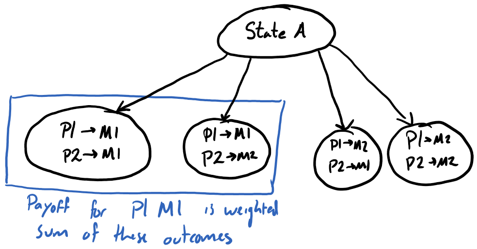
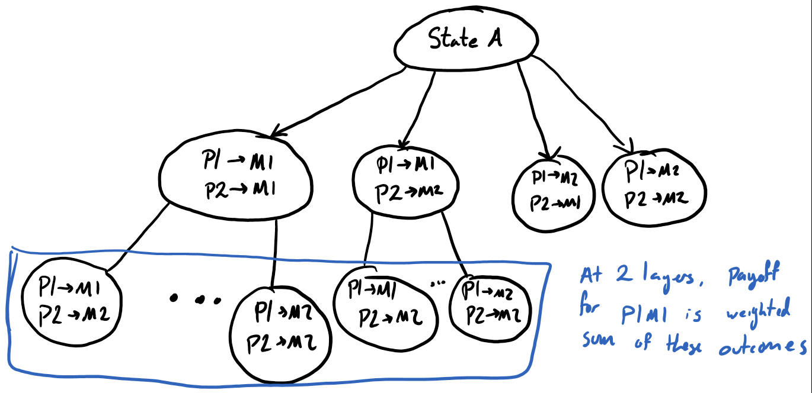
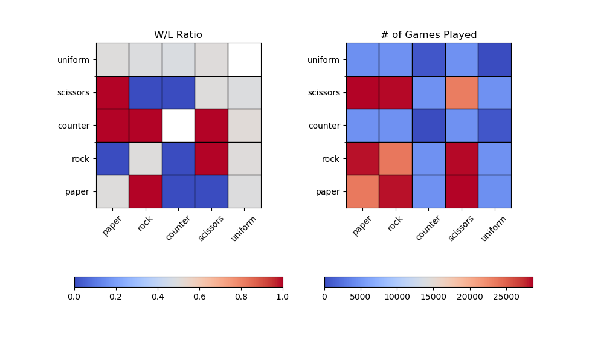
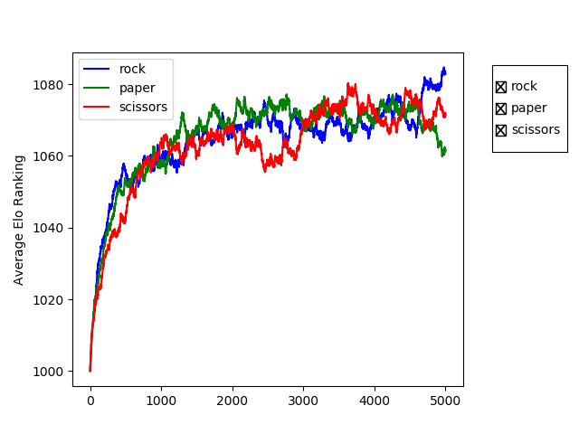
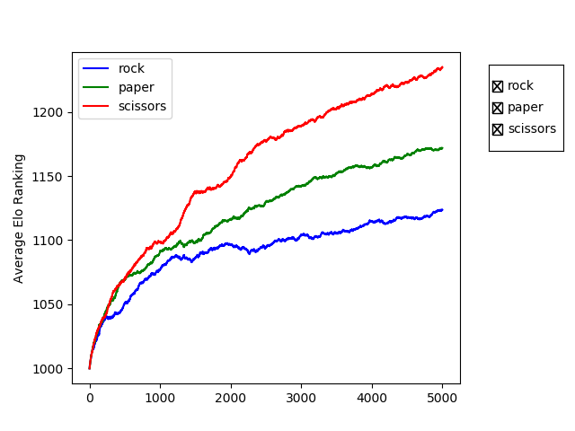

# Model Proposal for PS!ABM
Ali Turfah
* Course ID: CMPLXSYS 530,
* Course Title: Computer Modeling of Complex Systems
* Term: Winter, 2018


&nbsp; 

### Goal 
 
The goal of this project is to create a model of the Pokemon Showdown (PS) metagame. The primary results of interest are the emergent strategies that correspond to "high-ladder" play, as well as how they manifest themselves in the actual battles.<br/>
Ideally this will be done by building up from the rules simpler turn-based games, like Rock, Paper, Scissors (RPS) with varying strategies.

### Background

#### Terms

A pokemon has one or two of 16 types, health, speed, defense and attacking values that are used to calculate how much damage it takes/recieves, as well as how many attacks it can take before 'fainting'. If a pokemon has 'fainted', it is unable to be used and therefore cannot be switched to. A battle is over when all of a player's pokemon have fainted.
Moves are either attacking or status moves, where the former's purpose is to deal damage whereas the latter is used for secondary secondary effects like halving an opponent's speed or increasing the user's attack. In additon each move can only be used a limited number of times, however this rarely comes into play.
Items are equipment that can be attached to a pokemon to grant secondary effects. For example, a "Choice Band" multiplies a pokemon's attack statistic by 1.5 at the cost of locking into a single move, whereas an Aguav Berry restores 50% of a pokemon's health once it gets below 25% of its maximum Hit Points. A pokemon can only equip one item.
A set refers to a pokemon with specific moves, battling statistic values, and item of choice. Variations on sets exist, where moves/statistics can be modified for specific uses. 


#### Pokemon Battes

Under normal conditions, during each turn of a Pokemon battle a player has 9 possible moves that they can make; choosing from one of 4 attacks or switching to one of the 5 teammates. 
Initially each turn has roughly 81 possible outcomes (the pairs of each player's nine choices), each resulting in a different battle state. So, one can calculate the payoff of a player's move is the weighted sum of the outcome of all the opponent's moves, given the player's move (Figure 1 below). Projecting two turns forward, each of these 81 turns can result in roughly 81 different outcomes, for 81<sup>2</sup> possible outcomes in two turns. To consider the payoff in this situation, one would need to take a weighted sum over the second level of moves that emerge from that player's move (Figure 2 below). Because of the immense space that the possible combinations of turns can result in, it is usually not particularly helpful to proceed in calculating too many turns in advance.

<br/>
<small>Figure 1: Outcomes needed to be considered for payoff of Player1 Move1  (P1M1) at one layer.</small><br/>
<br/>
<small>Figure 2: Outcomes needed to be considered for payoff of Player1 Move1 (P1M1) at two layers.</small><br/>

In reality, a player does not know the opponent's set from the start, and oftentimes recieves incomplete information regarding which set the opponent is using. For example, a player only sees the percent damage an opponent recieves (as opposed to the exact value of hit points lost), and only sees a move once the opponent uses it. This can lead to interesting mindgames where players can bluff certain sets, however this behavior is not of particular interest at this point in time.

&nbsp;  
### Justification
Mathematical or Verbal models would not be able to adequately represent this system. A mathematical model would just explode in the number of equations necessary to represent the system, which would not be able to capture the random aspects of the game. A verbal model, on the other hand, would have to be incredibly complex to account for the different types of situations that a game can take. Thus, agent-based modelling is an appealing choice because each player's teams and strategies can easily be represented as class attributes and functions respectively. It would also allow for a much finer way to incorportate subtle differences in how players make their moves with simple modifications to if-else statements.


&nbsp; 
### Main Micro-level Processes and Macro-level Dynamics of Interest

The Micro-level process is how the game plays out. In the case of Rock/Paper/Scissors, it is which move the players cast. In the case of pokemon, it is the decisions made at each turn by the players (switching, attacking, setting up). These decisions will be based on optimizing some 'battle position' function, which assesses the current state of the game and compare it to the hypothetical game state should the player make a move. This function is discussed in the `PokemonAgent` section below.
&nbsp; 
The Macro-level process of interest is which strategies tend to dominate and the trends in dominant strategies. Since PS matches players based on Elo ranking (as opposed to randomly), another feature of interest is how that affects metagame development/which strategies dominate.


## Model Outline

### 1) Environment
The environment will be the "ladder", or the matchmaking service that pairs players for a battle. There will be two types of ladders, one that pairs players based on Elo Ranking (```WeightedLadder```) and another that pairs them randomly (```RandomLadder```). The ladder is also responsible for updating player scores after a game is completed.

#### Properties
<ul>
<li><i>player_pool</i>: List of players availible to play.</li>
<li><i>game</i>: GameEngine specifying game to be played.</li>
<li><i>k_value</i>: K value to use in updating Elo scores.</li>
<li><i>num_turns</i>: Number of games that have been played.</li>
</ul>

**Function to match players (ladder/base_ladder.py)**
```python
def match_players(self):
    """Return a pair of players to play."""
    # Select a random player
    player_ind = randint(low=0, high=len(self.player_pool))
    player = self.player_pool[player_ind][0]
    del self.player_pool[player_ind]

    # Select that player's opponent (based on waiting function)
    opponent_pair = sorted(self.player_pool,
                            key=lambda val: self.match_func(player, val),
                            reverse=True)[0]
    opponent = opponent_pair[0]
    opponent_ind = self.player_pool.index(opponent_pair)
    del self.player_pool[opponent_ind]

    self.num_turns += 1
    return (player, opponent)
```

**RandomLadder weighting function (ladder/random_ladder.py)**
```python
def match_func(self, player1, player2_pair):
    """
    Return random value as a match weighting.

    Since players will be sorted this random value, it is
    equivalent to randomly choosing an opponent.

    :param player1: BaseAgent
        The player who is being matched
    :param player2: (BaseAgent, int)
        The candidate player & turns waiting pair for a  match
    """
    return rand()
```

**WeightedLadder weighting function (ladder/weighted_ladder.py)**
```python
def match_func(self, player1, player2_pair):
    """
    Calculate the match score for two players.

    Players with similar elo rankings should be matched together.
    In addition, players who have been waiting for a long time should
    get to play sooner.

    Functional form is <Turns_waiting>/abs(<Difference in Elo scores>)

    :param player1: BaseAgent
        The player who is being matched
    :param player2: (BaseAgent, int)
        The candidate player & turns waiting pair for a  match
    """
    elo_factor = 1/max(abs(player1.elo - player2_pair[0].elo), 1)
    turn_factor = max((self.num_turns - player2_pair[1]), 1)

    return elo_factor*turn_factor
```

**Function to update player rankings (ladder/base_ladder.py)**
```python
def update_players(self, winner, loser):
    """
    Update values for winner and loser.

    :param winner: BaseAgent
        Player who won
    :param loser: BaseAgent
        Player who lost
    """
    new_winner_elo = elo(winner, loser, 1, self.k_value)
    new_loser_elo = elo(loser, winner, 0, self.k_value)
    winner.elo = new_winner_elo
    winner.num_wins += 1
    loser.elo = new_loser_elo
    loser.num_losses += 1
```

**Function to run a game (ladder/base_ladder.py)**
```python
def run_game(self):
    """Match players and run a game."""
    player, opp = self.match_players()
    player_copy = deepcopy(player)
    opp_copy = deepcopy(opp)

    outcome = self.game_engine.run(player, opp)

    if outcome == 1:
        self.update_players(player, opp)
    else:
        self.update_players(opp, player)

    self.add_player(player)
    self.add_player(opp)

    return (outcome, player_copy, opp_copy)
```

&nbsp; 

### 2) Agents

#### BaseAgent
The agents in the system will be the players. All agents will be subclasses of ```BaseAgent```, which has the following attributes:
<ul>
<li><i>id</i>: Unique identifier of an agent. Defaults to random uuid4.</li>
<li><i>type</i>: Category/Classification of an agent. This has meaning in the subclasses. Defaults to "Default".</li>
<li><i>elo</i>: This player's Elo ranking.</li>
<li><i>num_wins</i> and <i>num_losses</i>: This player's number of wins/losses respectively.</li>
</ul> 

In addition to the attributes above, all agents have the following methods. Please see ```agent/base_agent.py``` for more detailed documentation.
<ul>
<li><i>hello()</i>: Test command to print some generic information.</li>
<li><i>win_loss_ratio()</i>: Return the player's win/loss ratio.</li>
<li><i>total_games()</i>: Return the total number of games a player has played.</li>
<li><i>print_info()</i>: Print more detailed information about this player.</li>
<li><i>make_move()</i>: Function call to make a move. Raises <i>NotImplementedError</i>.</li>
</ul>

#### RPSAgent 
Players for RPS are defined by the class ```RPSAgent```. For a game of RPS, the agents are given strategies, which are lists of the probability that they play a specific move. For example, a player who only plays rock would have a strategy of [1, 0, 0], and a player who plays randomly would have a strategy of [1/3/, 1/3, 1/3]. This is reflected in the updated make_move() call.

**RPSAgent's make_move() function**
```python 
def make_move(self):
    """Play one of rock, paper, scissors defined by strategy."""
    num = uniform()
    for i in range(3):
        if num < sum(self.strategy[:i + 1]):
            return i

    raise RuntimeError("Something went wrong with strategy selection")

```

#### CounterRPSAgent
A ```CounterRPSAgent``` is a special kind of ```RPSAgent```. On the first turn it plays one of Rock, Paper, or Scissors with randomly. Then on all following turns, it plays the move that would beat the opponent's last move. The call for make_move() is shown below.

**CounterRPSAgent's make_move() function**
```python
def make_move(self):
    """Counter opponent's last move."""
    if self.last_move is None:
        return super().make_move()

    return (self.last_move + 1) % 3
````
&nbsp; 

#### PokemonAgent
A preliminary version of ```PokemonAgent``` has been implemented, with methods to make moves and update their internal game state. This class has the following attributes.
<ul>
<li><i>team</i>: A team of 6 pokemon that are used in battle.</li>
<li><i>game_state</i>: The state of the game, <b>to the player's knowledge</b>. The player's knowledge part is important because not all information is readily availible from the start, so uncertainty is unavoidable.</li>
</ul>
Similarly, the player will also need additional methods. They are as follows:
<ul>
<li><i>make_move()</i>: Decide what move to make at this specific turn. The current implementation randomly decides whether or not to switch or attack, and makes a random choice from there.</li>
<li><i>switch_faint()</i>: Decide which pokemon to switch to once a teammate has fainted. This is considered a 'free switch', since it will take no damage upon siwtching in. Again the current implementation is a random choice.</li>
</ul>

**PokemonAgent's make_move() function**
```python
def make_move(self):
        """
        Make a move.

        Either use random move or switch to first pokemon.
        """
        response = ()
        can_switch = len(self.gamestate["team"]) > 0

        if can_switch and uniform() < 0.5:
            response = "SWITCH", 0
        else:
            move = uniform(0, len(self.gamestate["active"].moves))
            move = int(move)
            response = "ATTACK", move

        return response
````

**PokemonAgent's battle position function**
<br/>
There are multiple possible ways to inform a player's move, given their battle position. A simple way to calculat ethis would be to compare the player's team health (hitpoints remaining/Maximum hitpoints) to his opponent's team health (calculated the same way), and play in a way to maximize damage given for damage received. This metric assumes each pokemon is equally important for a given battle.

A more nuanced version would weight and normalize the player's team health by the amount of damage they can deal to the opponent's remaining team. So, a pokemon that can do very little damage to the opponent would be weighted extremely low, and thus having that pokemon faint would decrease the player's position function very minimally. In addition, this version allows values to change as a battle progresses. So, once a pokemon has served its purpose and is no longer useful, its weighting would decrease as there isn't much left on the opponent's team that it can help against. This method is biased against defensive pokemon, who do not often deal large amounts of damage, and so would need to be further tweaked to account for that.

### 3) Action and Interaction 
 
**_Interaction Topology_**

The choice of ladder determines who gets to interact with whom. Should a ```WeightedLadder``` be chosen, matching will be made based on Elo ranking. Alternatively, a ```RandomLadder``` will match players randomly.
 
**_Action Sequence_**

Each agent calls their ```make_move()``` function at each turn. An example can be found in the `RPSAgent` or `PokemonAgent` section above.

&nbsp; 
### 4) Model Parameters and Initialization

Simulations can be carried out using ```run_simulation.py```, with the specific simulation files contained in the ```simulation``` directory. Each simulation will, by default, generate a csv file at the end of each game that is played. In addition, the simulation is run with a specified ladder, and has the following parameters:
<ul>
<li><i>num_players</i>: Number of players to have in this simulation.</li>
<li><i>num_runs</i>: Number of games to simulate.</li>
<li><i>game</i>: The game to be played in this simulation</li>
<li><i>ladder</i>: Which ladder (weighted or random) to use for the simulation.</li>
</ul>

All players in a simulation will be initialized with an Elo score of 1000. This way, there is no initial preference to matching.

RPS simulations take the additional _proportion_ argument which specifies the proportion of Rock, Paper, Scissors, and Uniform players to add to the simulation.

There are three levels of control for the ticks in this simulation--the ladder, game, and player. These are defined in the ```run_game()```, ```run()```, and ```make_move()``` functions respectively. 

For a single interaction, the process is below.
<ol>
<li>The ladder selects to players to play each other, removing them from the player pool.</li>
<li>The game engine runs a game with the players involved.</li>
    <ol>Repeat until condition for ending the game is met
        <li>The players make their moves simultaneously.</li>
        <li><i>If applicable: </i>The game engine updates its internal state to reflect the moves made.</li>
        <li><i>If applicable: </i>The players update their internal game states to reflect the moves made.</li>
        <li>If the condition for ending the game is met, decide a winner.</li>
    </ol>
<li>Update the rankings for the players.</li>
<li>The players are returned to the player pool.</li>
</ol>

&nbsp; 

### 5) Assessment and Outcome Measures

The behavior of interest is how the players behave in battles. This includes prediction of oppnent's moves, playing towards a 'win condition', and decision-making under uncertainty. The emergent property of interest is how the metagame develops, which pokemon rise to dominance, and general usage trends.

At the battle level, logs of battles will be have to be manually tracked to make sure proper decisions are being made. At the metagame level, the only real measure of accuracy is current ladder statistics, which would be dependant on whether or not agents can change their teams. If not, preformance of teams will be 'validated' against the actual PS ladder.

In the best case, an interface would be able to be put on the agent so that way a human can actually play against an automated agent. 

At the metagame level, analysis of how strategies fare against one another can be visualized with matchup heatmaps. Some sample visualizations can be found below, which visualizes a series of RPS games between Rock, Paper, Scissors, Uniform, and the Counter strategies. This example was done using a weighted ladder. The details of the simulation can be found under `sample_simulations/sample_multiturn_rps.txt`.
<br/>


&nbsp; 

### 6) Parameter Sweep

The main parameter of interest is the development of dominant agent strategies; how the agents make their moves, how they operate under uncertainty, how they respond to their opponent's strategies, etc. Therefore, simulations will need to be done across these strategies, including the depth of possibility trees to search, as well as interactions with each other. 

In addition, I'm interested to see how the use of a weighted ladder scheme as opposed to a random matching scheme changes the results. For example, in a Rock/Paper/Scissors simulation one would expect the ratings of the respective agents to fluctuate (because as certain strategies dominate, the reward for countering them increases significantly) as seen below.<br/>
<br/>
Conversely, when matching players against those with similar Elo rankings, we see a significant difference in the overall development. The strategies section off, and since the players who would be able to counter the dominant strategy never play against it, the cyclic pattern does not occur.
<br/>


_Simulations were run for 50,000 iterations with 100 of each type of RPSAgent. Measures for average elo rankings were taken every 10 iterations._